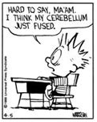

##
This class was a bit of a surprise for me, I was actually pretty convinced at the beginning of the semester that I probably wouldn't like it. There was a lot of work involved, expecially at the begining of this semester. The constant things due along with the in class WODS made it extremely stressful. I dropped a class to allow me extra time to study because I felt I was at a disadvantage being a non-ICS major. This was a good thing because I really needed the time, this was my first javascript class and I spent the first few weeks being completely lost. But working through it eventually became sort of enjoyable, it was NOT fun, or something I looked forward too, but there is a sense of pride you get from acomplishing difficult tasks. Starting each week with a "WTF am I looking at?" and ending it with a "I got this". With that slowly becoming the norm, it proved that, everything new is going to suck at first, but with enough effort, it can become managable. The main idea being effort. I've always liked the idea that the effort you put into a project should always payoff. The greater the effort, the bigger the payoff. How well you do will lie specificly on how much effort you invest. This type of class is unfortunatly rare. For example, out of all my classes this semester, this was the only class that I felt like respected the ammount of time I invested in it. As such, while this class was not fun, this was the only class I actually enjoyed this semester. Along with being enjoyable, this class also helped to show me what kind of things are possible with enough coding experience. The final project was an amazing experience for me.

### Functional Programming

Some of the  topic highlights of this class for me was coding standards, Functional Programming and agile project managment.
Functional programming was the third topic we learned about this semester. This might seem like a simple topic. But again, this was the first class I had to use javascript in. This topic served as an introduction to javascript and the underscore library for me. Functional programming is basicly how you structure your code. Rather then relying on for or if loops to compose your code, you call functions instead. For me, this made things simpler and less of an eye sore to look at. It just made more sense to me then the loops and helped me to make sense of javascript. This coding technique changed how I think about coding.

### Coding Standards 
 
Coding standards was another interesting topic for me. It was also something I was aware of from previous classes, but was never really fleshed out. I just thought it was how we spaced our code, if it's a part of a loop indent...etc But in this topic we were introduced to a program called ESlint. ESlint checks our code for us and helps us follow the coding standards even if we are not entirly sure what they are. One thing that surprised me about this was that according to coding standards, the double quotations, "" is not acceptable, rather we should be using the single quotations. 
Coding standards didn't seem like a big deal untill the final project. By following the standards, it made reading other people's code a lot easier. Not to mention, having a program constantly check our code probably saved us from a lot of errors later on in the project. Very useful topic and something I will continue to apply in the future.

### Agile Project managment

This was another interesting topic that we coveered in this class. Agile project managment is basicly a way to coordinate with a group of people to work on a project together. For this class we used Github for this. Github already comes with tools for project managment in their website. It allows users to create projects and assing issues to different team members. An issue is a short term goal, which once the team member completes can mark it as done and move on to another issue. It also offers a to do list so everyone can keep track of the progress of the project and be reminded on what they need to do. This made the final project so much easier to manage, expecially since we couldn't meet in person and had to rely on online meetings to plan out project. The one thing that I think we had problems with was the creation of issues. Some issues, looking back, should have been actually 3 or 4 issues, not one. Since that one issue we assigned actually had multiple steps to it. But this was more of a problem of not understanding what the project required. This is yet another topic that I plan on using in the future, expecially if it involves a group of people. This also would be useful in everyday life to keep track of what you are doing and needs to be done, whether it is homework or just chores.

###
It seems the topics that I found interesting in a software engineering course doesn't relate to coding directly, but are tools by which to make coding easier. Function programming offers a better way to write your code to organize it better. This goes the same for coding standards. Agile project managment offers a better way to plan and execute your goals, with or without a group. These tools are useful regardless of which coding language you are using and are all things I plan on using in the future to make coding a bit more manageable.

PS I love Calvin and Hobbes and I feel that there always is a Calvin and Hobbes strip that is relevant to anything life throws at you.

