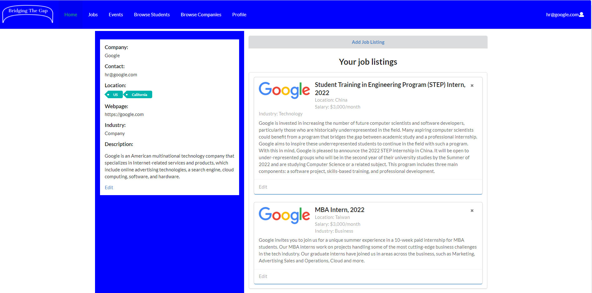

Project details:
Bridging the gap is an app that seeks to solve the problem students have with finding jobs or internships at companies. This app allows students to create a profile and add their resume for companies to view. This app also gives students the freedom to search companies by location and their job offereings by skill set. I was in charge of creating the company homepage, company profile page, company profile edit and the ability to add jobs to the company profile.

This project allowed me to experience first hand what it is like to work as a group on a coding project. Not to mention the steps need to finish and publish said app. I think the hardest part of this project was working with people, you idn't know what they were doing or what they were changing. Multiple times I would do something and get an error because someone else had changed something that I was working on. TestCafe also presented a lot of problems. I'm not sure if it was how we were writing our tests or the github servers, but we would have times where we would run the tests locally, the tests pass, then when we upload them to the server, where they will all fail. It was pretty fustrating. That was also another thing I learned how to do, troubleshooting by trial and error.

